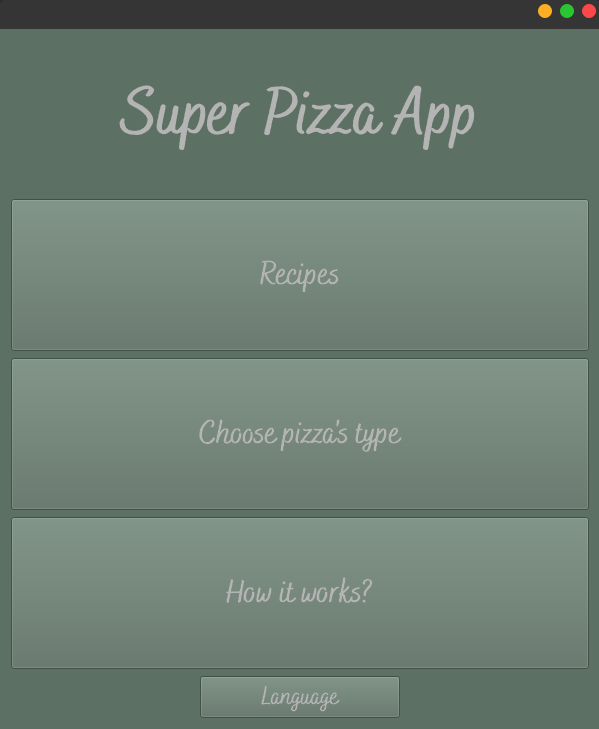
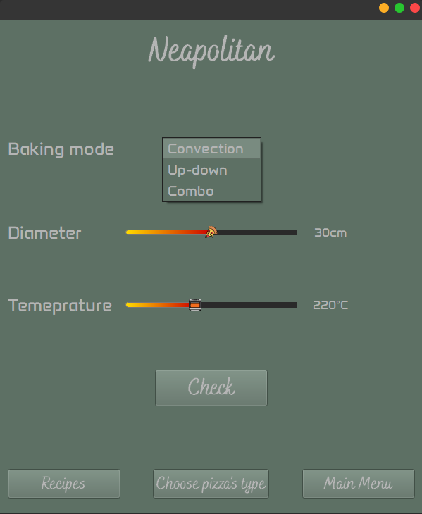
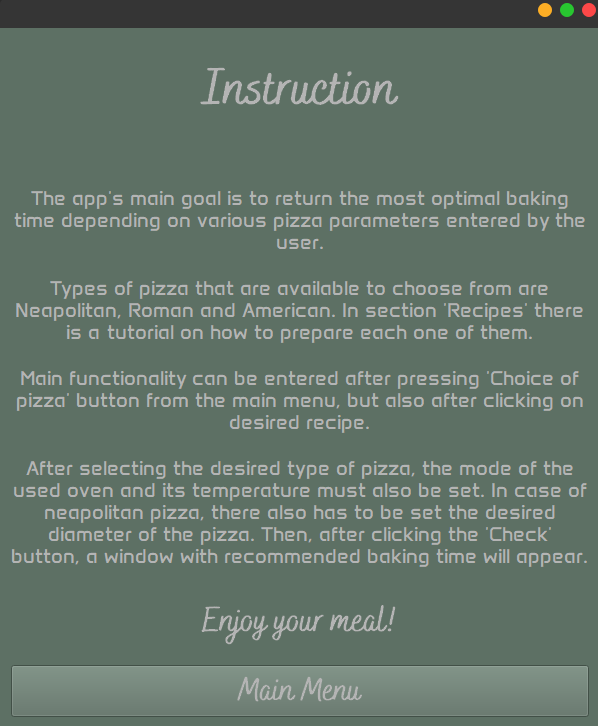

# Pizza App
## Authors: Julia Grzegorzewska, Alicja Myśliwiec
## Table of contents

### Description
This applicaton is a part of bigger study project about pizza baking optimalization and based on self experiments, physical laws and results of conducted survey. 
Its main purpose is to return the most optimal baking time based on given information such as maximum oven temperature, diameter of dough, type of pizza or owned cooking mode. 

### Technologies
- **Python** - Programming language of whole project (version 3.9 or bigger recommended)
- **PyQt5** - library for creating GUI
- **sympy** - library for symbolic mathematics
- **qtmodern** - package aimed to make PyQt/PySide applications look better

### How to run this app (using cmd)
1. Clone the project: \
`git clone https://github.com/grzesiaaa/Pizza-app.git Pizza_app`
2. Go to folder with the app:\
`cd Pizza_app `
3. Install the project's development and runtime requirements:\
`pip install -r requirements.txt`
4. Run the app:\
`python Pizza_app.py`

### Screenshots
Several screenshots showing the appearance of the app and encouraging you to use :blush:

